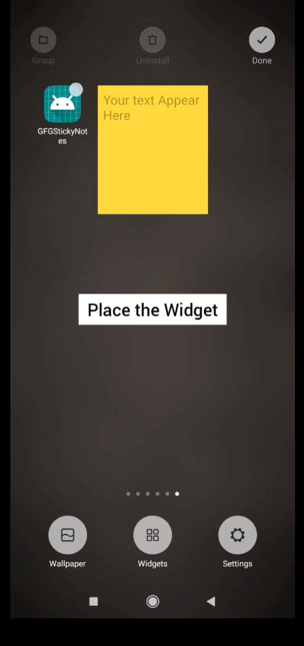
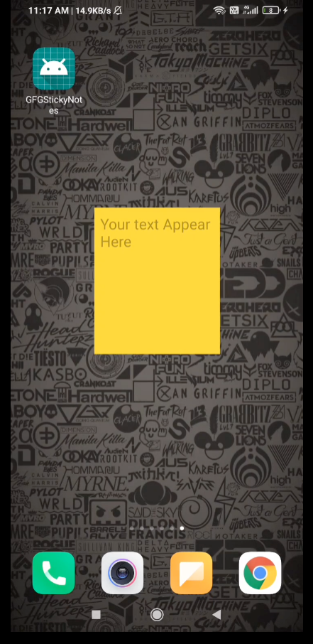
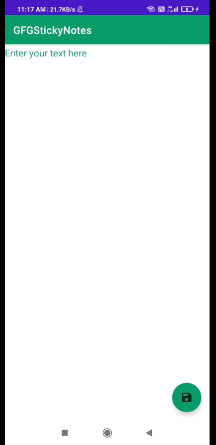
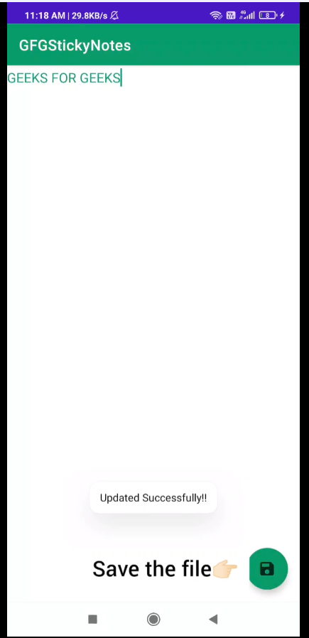
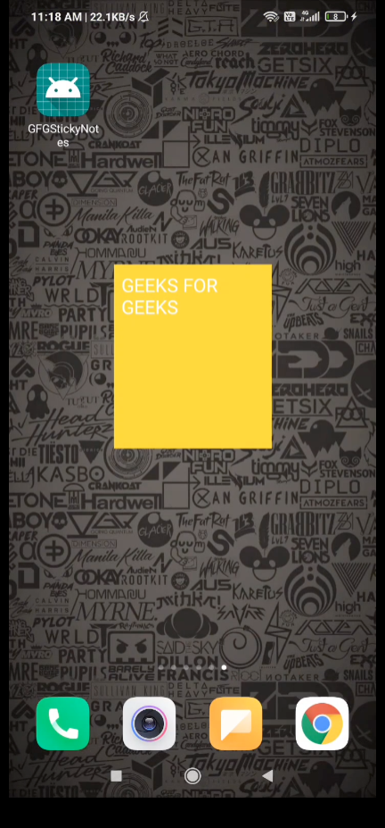
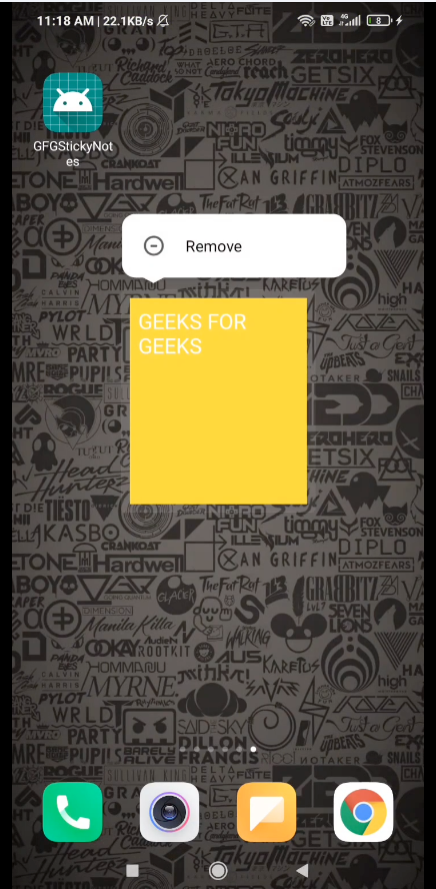

# StickyNotes
This is similar to the Sticky Notes on Windows and Stickies on Mac. 
The app uses the Widgets which act as notes.  
They can be placed anywhere on the screen and can be resized. 
The user can add items/text to the notes.

# Technologies used
This app is built using-
- Java

# Demo
Step 1: Select the Widget  

Step 2: Place the Widget  

Step 3: Open the Widget and enter your note  

Step 4: Save the file  

Step 5: Your note is ready, check your home screen  

Step 6: Additionaly, if you want to delete your note/widget, long press the widget and select remove option  
 